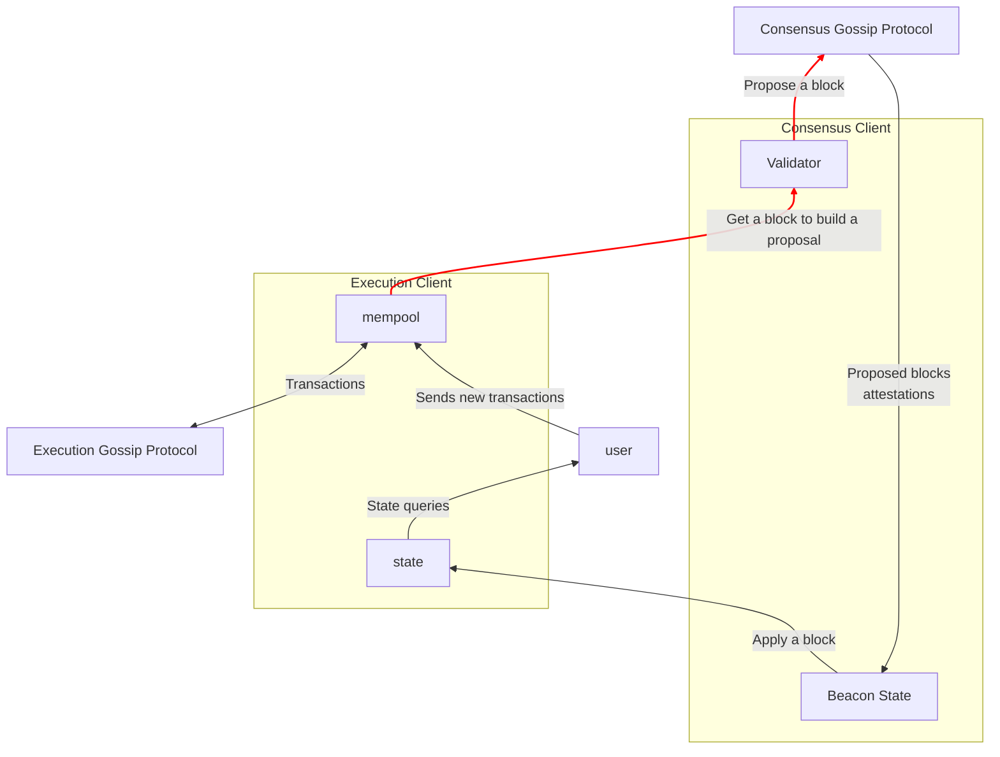

## Ethereum Network

What is the Etheruem network?[^1]

-   A user of the network sends a transaction (e.g. an ETH transfer) to the
    network.
-   The network validates the transaction.
-   The network includes the transaction in a block.
-   The network includes the block in the chain, so the new state includes the
    transaction sent by the user. Any user can request this information and the
    change will be reflected.

The problem here is: what does sending something to the network mean?

## Execution and Consensus clients

A full node is split into two clients:

-   **The execution client** knows how to represent the EVM state and apply
    state changes (transactions) to generate new states. It represents the state
    machine.
-   **The consensus client** knows very little about the state machine, but
    knows how to choose between different worldviews and agree with other nodes.
    It enables the execution client to apply the correct state transitions.

You might notice there's a section called "validator" in there, with red arrows.
Your node is considered a validator if it has 32 ETH staked in the validator
contract, which makes it capable of proposing new blocks and attesting to other
proposals. That is: actively participating in the protocol and getting rewards
for it.

If you're not a validator you can still participate though! The block diagram is
the same, without the red lines (and you won't receive rewards for it). You can
still send transactions to your local node, propagate them to others, and
receive updates.

## Lifecycle of a transaction

Here's the full sequence from the perspective of a non-validator node:

1. A user builds, signs, and sends a transaction to their execution client's
   JSON-RPC API. This is usually done with a wrapper library like `ethers`,
   `hardhat`, or `foundry`.

2. The execution client receives the transaction and:

    1. Validates it (checks the user has enough ETH, the signature matches,
       etc).

    2. Adds it to its local mempool. The mempool is a local pool of transactions
       that are not yet executed.

    3. Broadcasts it through the execution gossip layer, to other execution
       nodes. Other execution nodes include it in their mempools.

3. A validator node is selected as a block proposer. As a proposer:

    1. Their execution client bundles many transactions from its mempool into a
       block.

    2. All transactions in the bundle are executed locally and state change is
       calculated.

    3. Their consensus client gets this block (or as consensus calls it,
       "execution payload") and adds consensus layer information, like
       attestations, slashings, rewards, penalties, etc. The execution payload +
       consensus metadata forms a "beacon block".
    4. The beacon block is signed and sent over the consensus gossip layer to
       other nodes.

4. A committee of validators validates that block and sends signed attestations
   for it over the consensus gossip protocol too.

5. All nodes receive both the new proposed block and attestations. Then they:
    1. Include the new block in their local fork tree if it's valid.
    2. Save the attestations and update the weights of the blocks on the tree.
    3. Apply fork choice to recalculate, if necessary, what blocks are included
       in the canonical chain.
    4. The changes + the new block are propagated to the execution node so
       transactions are applied and the state is changed and up to date.

[^1]:

The Ethereum network is not a networked database: It's a series of tubes. And if
you don't understand, those tubes can be filled and if they are filled, when you
put your message in, it gets in line and it's going to be delayed by anyone that
puts into that tube enormous amounts of material, enormous amounts of material.
Ted Stevens (2024) Wikipedia. Available at:
https://en.wikipedia.org/wiki/Ted_Stevens (Accessed: 03 April 2024).
