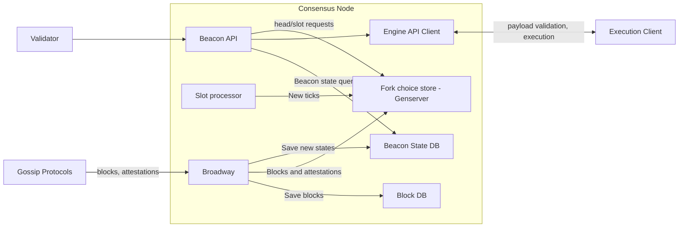
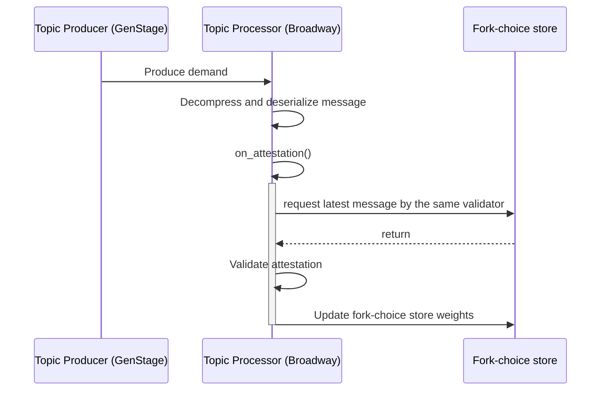
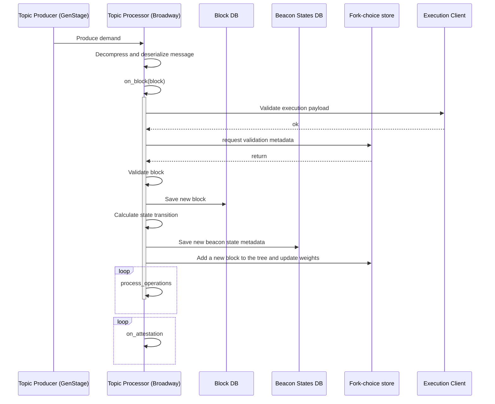

## Requirements

-   Operate as a self-reporting node operator
-   Operating using MEV-Boost

## Protections

Node Operators are being provided with a tailored risk management solution that addresses the unique challenges and
risks of participating through the relay.

> Read more at [Relay: Captive Insurance](../Relay/captive-insurance.md)

This is a block diagram of all the parts of the system and will be updated as needed.

## Networking

The main entry for new events is the gossip protocol, which is how consensus nodes communicates with other consensus
nodes.

1. Discovery: our node has a series of known `bootnodes` hardcoded. We request a list of the nodes they know about and
   add them to our list. We save them locally and now can use those too to request new nodes.

2. Message propagation. When a proposer sends a new block, or validators attest for a new block, they send those to
   other known nodes. Those, in turn, propagate the messages sent to other nodes. This process is repeated until,
   ideally, the whole network receives the messages.

## Gossipsub

One of the main communication protocols is GossipSub. This allows us to tell peers which topics we're interested in and
receive events for them. The main external events we react to are blocks and attestations.

### Receiving an attestation

When receiving an attestation, it's processed by the
[on_attestation](https://eth2book.info/capella/annotated-spec/#on_attestation) callback. We just validate it and send it
to the fork choice store to update its weights and target checkpoints. The attestation is only processed if this
attestation is the latest message by that validator. If there's a newer one, it should be discarded.

The most relevant piece of the spec here is the [get_weight](https://eth2book.info/capella/annotated-spec/#get_weight)
function, which is the core of the fork-choice algorithm. In the specs, this function is called on demand, when calling
[get_head](https://eth2book.info/capella/annotated-spec/#get_head), works with the store's values, and recalculates them
each time.

!!! important

    It is a requirement that the validator cache the weights and the head root each time it adds a block or attestation: so it won't need to do the same calculations again.
    Additionally, it should save the latest messages in persistent storage as well so that if the node crashes it can recover the tree weights.

### Receiving a block

Receiving a block is more complex:

-   The block itself needs to be stored.
-   The state transition needs to be applied, a new beacon state calculated, and stored separately.
-   A new node needs to be added to the block tree aside from updating weights.
-   on_attestation needs to be called for each attestation.

Also, there's a more complex case: we can only include a block in the fork tree if we know of its parents and their
connection with our current finalized checkpoint. If we receive a disconnected node, we'll need to use Request-Response
to ask peers for the missing blocks.
