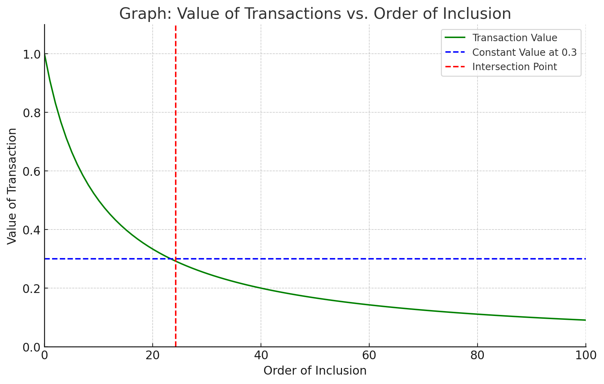

## Forward Contracts

### Nature of the Forwards to be sold

The embedded volumetric optionality is primarily intended, at the time that the parties enter into the agreement,
contract, or transaction, to address constraint factors that influence demand for transaction inclusion rights (i.e.
blockspace). This instrument addresses the potential variability in the supply of available blockspace available for
usage by different actors.

The options refer to slices of the overall gas size of β-blockspace. We aim to homogenize it, i.e. all slices of gas are
equal and interchangeable. This is how the forward contract is exercised.

The nature of the forwards we are selling under the β-blockspace market depends on the capacity restriction we impose.
Most importantly, do we guarantee enough capacity that the calls get included or not? The problem with guaranteeing a
fixed capacity for β-blockspace is that this means restricting the capacity for ⍺-blockspace. The problem with this is
that ⍺-blockspace might be more lucrative for us. In particular, we know that lottery blocks come along that make up a
large chunk of the overall remuneration we can achieve at all.

!!! info "Figure 1: Tradeoff of ⍺/β-blockspace"

    If we fix ⍺-blockspace, we might be missing a significant amount of value. The tradeoff can be seen in the picture below.

We make the assumption that top of the block gas space is more valuable. The main assumption is that at some point, the
marginal value for a builder owning the whole block (green) goes below the marginal value of a β-blockspace buyer
(typically someone who wants to be just included independently of the order).

If we had perfect information, we could fix the capacity constraint at exactly the intersection point. But this
information is not available. We can only approximate it. The question of lottery blocks can also be seen in the
diagram, the question is whether for such a block both curves are shifted in the same way. If not, it would indicate the
need to give ⍺-blockspace builders more space relative to β-blockspace builders.

<!-- There is another aspect to consider. The larger the ⍺-blockspace part, the
larger the possibility of including a txs in β-blockspace that will revert (due to state changes). This will
degrade the value of the option to buy β-blockspace space. What is more, this might jeopardize the service
as a whole. If builders get the impression that the service is not of sufficient quality, then they
will stop using it. So there is also a reputation component - in particular at the beginning.
-->

### Bidder characteristics

!!! info inline "Assumption of Intrablock Position"

    We operate under the assumption that position does not matter; if it does might affect the design
    significantly.

-   **Bidders are possibly risk-averse**: Standard revenue equivalence might go out of the window. Bidders are
    asymmetric; in particular if there is private orderflow.

-   **Bidders valuations are not clear**: If they draw from a public mempool or if there are global conditions affecting
    value of block space, their valuations will be interdependent. - There is also the danger of a further coordination
    issue; this might favor a winner-takes-all solution

## Relation to the secondary market

Traditionally we would assume that a well-designed auction does not require a secondary market. If the result of the
auction is in the core, no change in the allocation makes sense. This is different here as information comes in
overtime. - Base fee - Transactions updates for ⍺-blockspace bidders We operate under the assumption that position does
not matter; if it does might affect the design significantly.

New bidders are active on the secondary market. The secondary market therefore is not just a reallocation of the primary
auction but includes information updates.

!!! note "Secondary Market Effects"

    This is in contrast to most work on auctions with resale (re: secondary) markets. The secondary market changes the rationale for bidding in the primary auction
