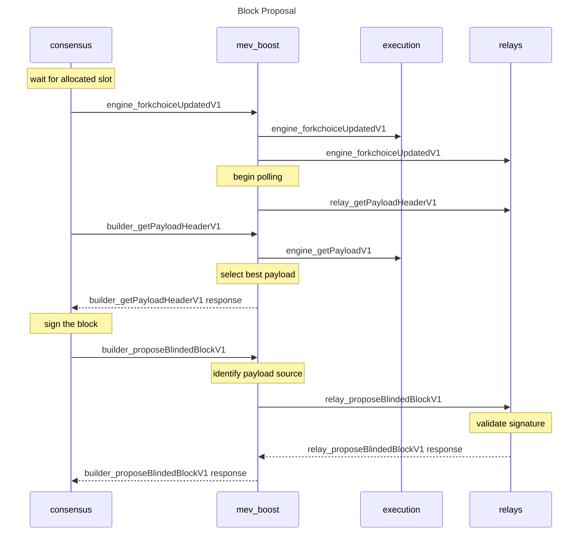
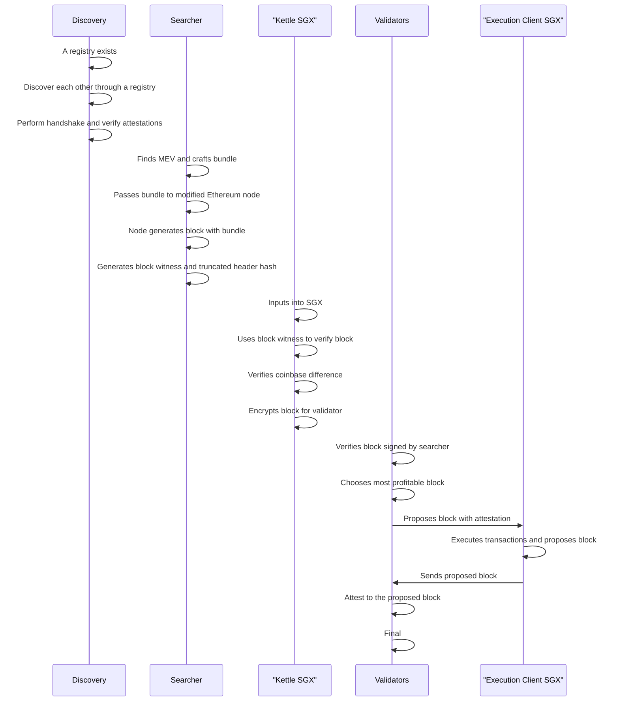

## MEV Boost

```mermaid
sequenceDiagram
    participant consensus
    participant mev_boost
    participant execution
    participant relays
    Title: Block Proposal
    Note over consensus: wait for allocated slot
    consensus->>mev_boost: engine_forkchoiceUpdatedV1
    mev_boost->>execution: engine_forkchoiceUpdatedV1
    mev_boost->>relays: engine_forkchoiceUpdatedV1
    Note over mev_boost: begin polling
    mev_boost->>relays: relay_getPayloadHeaderV1
    consensus->>mev_boost: builder_getPayloadHeaderV1
    mev_boost->>execution: engine_getPayloadV1
    Note over mev_boost: select best payload
    mev_boost-->>consensus: builder_getPayloadHeaderV1 response
    Note over consensus: sign the block
    consensus->>mev_boost: builder_proposeBlindedBlockV1
    Note over mev_boost: identify payload source
    mev_boost->>relays: relay_proposeBlindedBlockV1
    Note over relays: validate signature
    relays-->>mev_boost: relay_proposeBlindedBlockV1 response
    mev_boost-->>consensus: builder_proposeBlindedBlockV1 response
```

## Suave SGX

> Suave specification is in development, so terms may not be finalized.

```mermaid
sequenceDiagram
    participant Discovery
    participant Searcher
    participant Kettle_SGX as "Kettle SGX"
    participant Validators
    participant Execution_Client_SGX as "Execution Client SGX"

    Discovery->>Discovery: A registry exists
    Discovery->>Discovery: Discover each other through a registry
    Discovery->>Discovery: Perform handshake and verify attestations

    Searcher->>Searcher: Finds MEV and crafts bundle
    Searcher->>Searcher: Passes bundle to modified Ethereum node
    Searcher->>Searcher: Node generates block with bundle
    Searcher->>Searcher: Generates block witness and truncated header hash

    Kettle_SGX->>Kettle_SGX: Inputs into SGX
    Kettle_SGX->>Kettle_SGX: Uses block witness to verify block
    Kettle_SGX->>Kettle_SGX: Verifies coinbase difference
    Kettle_SGX->>Kettle_SGX: Encrypts block for validator

    Validators->>Validators: Verifies block signed by searcher
    Validators->>Validators: Chooses most profitable block
    Validators->>Execution_Client_SGX: Proposes block with attestation

    Execution_Client_SGX->>Execution_Client_SGX: Executes transactions and proposes block
    Execution_Client_SGX->>Validators: Sends proposed block

    Validators->>Validators: Attest to the proposed block
    Validators->>Validators: Final
```
