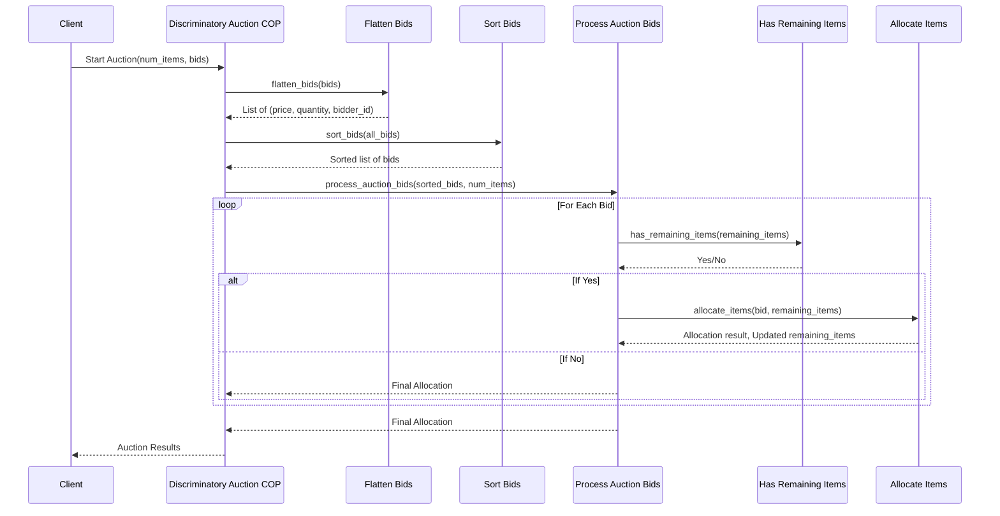

Client Starts Auction: The process begins with the client calling the Start Auction method, providing the number of
items and the bids.

Flatten Bids: The Discriminatory Auction (DA) system flattens the structured bids into a list of tuples. Sort Bids: The
flattened bids are then sorted in descending order based on the bid price. Process Auction Bids: Enters a loop to
process each bid in the sorted list.

Check for Remaining Items: For each bid, it checks if there are remaining items to be auctioned. If there are no
remaining items, the auction process is concluded, and the final allocation is returned. If there are remaining items,
it proceeds to allocate items based on the current bid. Allocate Items: Items are allocated to the bidder if the
conditions are met (i.e., there are enough remaining items to fulfill at least part of the bid). Loop Continues: This
loop continues until all bids are processed or there are no more items to auction

Auction Results Returned: Finally, the auction results are compiled and returned to the client.
