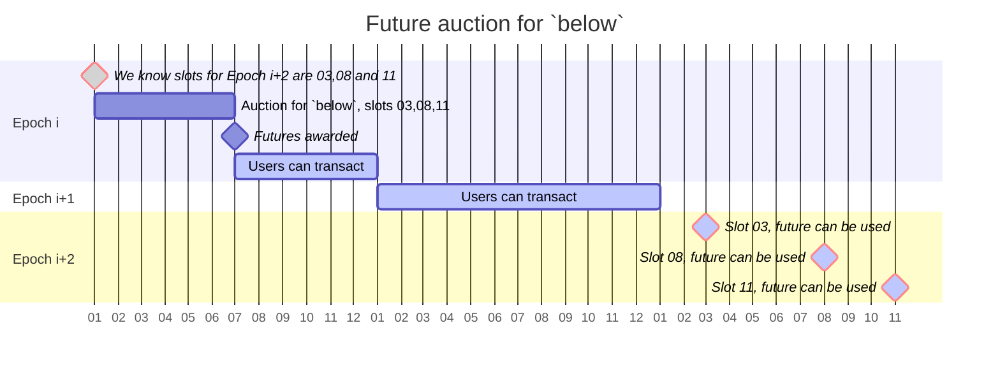

# eXtensible Gas Auction (XGA)

Multi-unit auctions, unlike their single-unit counterparts, present complex
allocation mechanisms. The MEV Auction platform implements several innovative
strategies:

1. An enhanced uniform price auction,
2. A Bifurcated Block Structure (splitting the block into halves),
3. Elastic Supply Scheduling,
4. Contract based bidding.
5. Backwards compatible with MEV-Boost
6. Exclusive Relay endpoint for Validator usage

## **Block Structure**

We divide a block in two parts: ⍺-blockspace and β-blockspace

`⍺-blockspace` is a very time sensitive kind of priority transactions. These
transactions often come in last second.

`β-blockspace` however can be considered non-priority sensitive, meaning it is
not very time sensitive, hence can be priced differently.

### **⍺-blockspace**

-   `⍺-blockspace` - represents the top part of the blockspace. Economically,
    this is where competitive searchers want to place their transactions (e.g.
    for arbitrages etc.).[^1]

### **β-blockspace**

-   ` β-blockspace` - represents the rest of the blockspace. Economically, this
    is where low-priority transactions - direct transfers, low volume swaps,
    some kind of intents, etc. - would go. The rationale for this is simple:
    `above` and below represent two very different markets: The first serves
    strategic actors, whereas the second serves 'everyone else' - people not
    interested in speculation that just want to transact, e.g., to pay for
    stuff.[^2]

The Auction platform uses the [SecureRPC.com](https://securerpc.com) relay, in
which permissioned validator sets use exclusively[^3]. As such, we will know 2
epochs in advance in which slots we will mint a block. Therefore, we can sell a
proportion of blockspace 2 epochs in advance, enabling a forward call market for
_β-blockspace_.

### **Elastic Supply Schedule**

**Elastic Supply Schedule**: Breaking away from the rigidness of a fixed supply,
we're introducing elasticity. When prices dip low, we'll strategically limit the
availability of options. This dynamic approach ensures a balance between supply
and demand, maintaining value and interest.

**Revamped Tie-Breaking Rule**: In the world of auctions, ties are inevitable.
Our approach is different. We're moving away from the conventional method that
prioritizes higher marginal bids. Instead, we're implementing a novel rule that
intensifies competition, particularly for those crucial marginal quantities.

## Why These Changes Matter

### Shortcomings of the standard uniform price auction

Traditionally, with a fixed supply, there's a looming risk of plummeting prices.
This phenomenon, identified by Wilson[^4], highlights a bidder's tendency to
underbid. In multi-unit auctions, this is a critical challenge. In a uniform
price auction, underbidding on the marginal unit doesn't just lower the price
for that unit; it slashes the overall price you pay.

The real danger of severe under-pricing hinges on demand factors, which are
often unpredictable and not easily deduced from existing data. The debate over
whether discriminatory or uniform price auctions yield higher revenue remains
unresolved, both theoretically (as discussed by _Ausubel_ et al. 2011) and
empirically.

### Tie Breaking Rule

The traditional tie-breaking rule, which prioritizes higher marginal bids, is
inherently flawed. It doesn't account for the strategic value of the marginal
unit. This is particularly problematic in multi-unit auctions, where the
marginal unit is often the most valuable. The current rule fails to capture the
true value of the marginal unit, leading to suboptimal outcomes. This is due to
the discrete nature of bids, it can happen that there is market-clearing price
(where demand=supply). The typical rule applied in many auctions favors high
marginal bids first. We will consider an alternative that introduces more
pressure at the quantity at the margin.

#### Elastic Supply Curve Detail

Maximum capacity is fixed, but the supply curve varies with price,

$S:P→Q$

Thus we have different offering quantities of options.

The supply function is designed to be initially concave, then constant at
maximum capacity. This approach, theoretically supported by Licalzi (2005)[^5],
aims to mitigate dramatic underpricing.

### Footnotes

[^1]: Previously this was called 'above'
[^2]: Previously this was called 'below'
[^3]: Exclusivity is only needed in v1, v2 eliminates this requirement.
[^4]:
    Robert Wilson, 1979.
    "<B><A HREF="https://ideas.repec.org/a/oup/qjecon/v93y1979i4p675-689..html">Auctions
    of Shares</A></B>," <A HREF="https://ideas.repec.org/s/oup/qjecon.html">The
    Quarterly Journal of Economics</A>, President and Fellows of Harvard
    College, vol. 93(4), pages 675-689.

[^5]:
    Marco LiCalzi, 2005.
    <A HREF="https://doi.org/10.1016/S0014-2921(02)00324-0">"Tilting the supply
    schedule to enhance competition in uniform-price auctions"</A> European
    Economic Review, Volume 49, Issue 1, 2005, Pages 227-250
