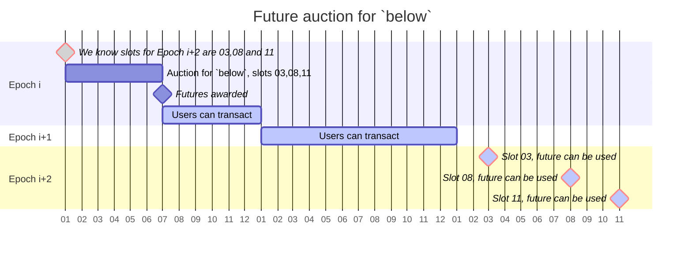

# Mechanisms make the market

XGA is a platform that is compromised of a Optimism based Rollup, a smart contract protocol, an Ethereum concensus layer
sidecar and a domain-specific engine called Open Games for proving/developing (game-specific) mechanisms.

> Open Games is an engine for proving/developing (domain-specific) mechanisms.

## Open Games Engine

The essential innovation is the decomposition of strategic interactions into atomic components. These components can be
assembled through a fixed set of operations while guaranteeing that the result is well-behaved -- i.e. forms a proper
_open game_.

The engine has two main components:

-   (i) it enables users to represent strategic interactions and
-   (ii) it enables them to analyze these games, typically checking whether a particular strategy is in equilibrium.

### Open Games Syntax

-   The graphical language operates in two dimensions. In the bimatrix case players 1 and 2 are put side-by-side as they
    move simultaneously. They are still connected though as their utility is affected not only by their own action but
    also by the action of the other player.

-   There is a way of stitching together the different components which mainly works along two time dimensions:
    simultaneous and sequential composition.

